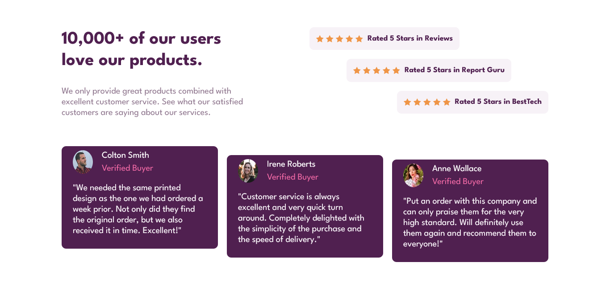
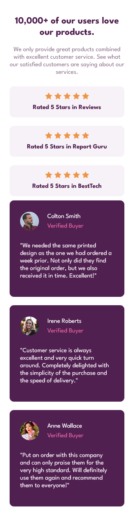

# Frontend Mentor - Social proof section solution

This is a solution to the [Social proof section challenge on Frontend Mentor](https://www.frontendmentor.io/challenges/social-proof-section-6e0qTv_bA). Frontend Mentor challenges help you improve your coding skills by building realistic projects.

## Table of contents

- [Overview](#overview)
  - [The challenge](#the-challenge)
  - [Screenshot](#screenshot)
  - [Links](#links)
  - [Continued development](#continued-development)
  - [Useful resources](#useful-resources)

### The challenge

Users should be able to:

- View the optimal layout for the section depending on their device's screen size

### Screenshot

### Links

- Solution URL: [Github](https://github.com/0300hrs/Social-proof-section/)
- Live Site URL: [Github Sites](https://0300hrs.github.io/Social-proof-section/)

### Built with

- Semantic HTML5 markup
- CSS custom properties
- Flexbox
- CSS Grid
- Mobile-first workflow

### Continued development

Getting to configure the layout for different screens remains a challenge, especially when deciding where to use a grid or a flex blox is required.

### Useful resources

- [MDN](https://developer.mozilla.org/en-US/docs/) - This helped me for systanx as always
